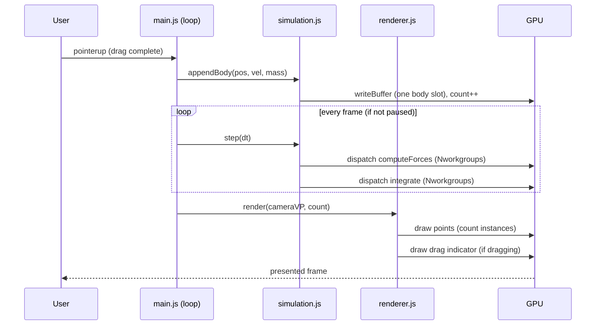

# starforge Design

## Overview
starforge is a single-page WebGPU application built from ES modules and standalone WGSL shader files, with no build step. It maintains body state (position, velocity, mass) in GPU storage buffers, advances it each frame with a velocity-Verlet integrator implemented across two compute passes, and renders the bodies as point sprites through a render pipeline. A small JS layer handles WebGPU init, the per-frame loop, camera math, pointer interaction, and UI controls (pause/reset). All physics runs on the GPU; the CPU only orchestrates passes, uploads uniforms, and appends user-added bodies.

## Architecture

### Components
- **`index.html`**: Page shell. Hosts the `<canvas>`, the control UI (pause/reset buttons, body count, fps), and a `#fallback` element for the unsupported/error message. Loads `src/main.js` as `type="module"`.
- **`src/main.js`**: Entry point. Detects WebGPU, wires up the app, owns the render loop and UI event handlers. On any init failure, reveals the fallback message and stops.
- **`src/gpu.js`**: WebGPU bootstrap — requests adapter/device, configures the canvas context, loads and compiles WGSL modules (via `fetch` + `createShaderModule`), builds pipelines and bind group layouts. Returns a structured object the rest of the app uses.
- **`src/simulation.js`**: Owns the body storage buffers (double-buffered position/velocity), the uniform buffer (sim params), the compute bind groups, dispatch logic, body seeding, and the append-body operation. Encapsulates the velocity-Verlet two-pass scheme.
- **`src/renderer.js`**: Owns the render pipeline, the camera uniform buffer, and the per-frame draw of points plus the drag-indicator overlay (drawn on the 2D canvas overlay or as a second pipeline — see Rendering).
- **`src/camera.js`**: Pure 2D camera: center (world), zoom (pixels-per-world-unit). Provides world<->screen conversion and produces a column-major mat3-equivalent (packed as needed) view-projection for the shader. No GPU dependency, unit-testable in isolation.
- **`src/shaders/nbody.wgsl`**: Compute shader. Two entry points: `computeForces` (accumulate acceleration into an accel buffer) and `integrate` (velocity-Verlet update of velocity and position). Alternatively a single kicked-leapfrog entry — see Algorithm.
- **`src/shaders/render.wgsl`**: Vertex + fragment shaders for point sprites. Vertex reads body position from a storage buffer (indexed by `instance_index`) and the camera uniform; fragment draws a soft round point.

### Data Flow



## Data Models

Body state is split into parallel storage buffers (Structure-of-Arrays) to keep WGSL alignment simple and let the integrator double-buffer positions cheaply. `vec2<f32>` requires 8-byte alignment; we store `vec2<f32>` per body.

```wgsl
// Per-body, Structure-of-Arrays. N = MAX_BODIES capacity.
positions : array<vec2<f32>>   // current position (world units)
velocities: array<vec2<f32>>   // current velocity (world units / sim-time)
accels    : array<vec2<f32>>   // acceleration from the most recent force pass
masses    : array<f32>         // body mass (>0)
```

```typescript
// CPU-side sim parameters uniform (std140-compatible layout, 16-byte aligned)
interface SimParams {
  dt: number;          // f32  fixed timestep
  softening2: number;  // f32  epsilon^2 (softening length squared)
  g: number;           // f32  gravitational constant (tunable scale)
  count: number;       // u32  active body count
}                      // 16 bytes total

// CPU-side camera uniform
interface CameraUniform {
  // packed as: scale.xy (clip units per world unit), translate.xy (clip offset)
  scaleX: number; scaleY: number;   // f32 f32
  transX: number; transY: number;   // f32 f32
  pointSize: number;                // f32 (clip-space half-size or px; see render.wgsl)
  _pad0: number; _pad1: number; _pad2: number; // pad to 32 bytes (16-byte multiple)
}
```

Buffer sizing: `MAX_BODIES = 4096` (capacity). `positions`/`velocities`/`accels` each `MAX_BODIES * 8` bytes; `masses` `MAX_BODIES * 4` bytes. `count` lives in `SimParams`, mirrored on the CPU as `activeCount`.

## N-body Algorithm

### Force computation (naive O(n^2))
For body `i`, acceleration is the sum over all `j != i`:

```
a_i = G * Σ_j  m_j * (p_j - p_i) / (|p_j - p_i|^2 + epsilon^2)^(3/2)
```

The `+ epsilon^2` term is **gravitational softening**: it removes the singularity as `|p_j - p_i| -> 0`, capping the maximum force and preventing slingshot/NaN blowups. `epsilon` is configurable (`SimParams.softening2 = epsilon^2`). Self-interaction (`j == i`) contributes zero because the numerator `(p_i - p_i)` is zero; we still guard by skipping `j == i` to avoid dividing by `epsilon^2` needlessly (harmless but skipped for clarity).

The compute shader uses a workgroup of 64 invocations; each invocation owns one body `i` and loops over all `j` in `[0, count)`. (Tiled/shared-memory blocking is a possible optimization but the MVP uses the straightforward global-memory loop for correctness and clarity.)

### Integration — velocity-Verlet (kick-drift-kick leapfrog)
Velocity-Verlet is symplectic and second-order, giving stable long-term orbits. Using the acceleration `a(t)` already stored from the previous force pass:

```
Pass A "integrate":
  v_half = v(t) + 0.5 * a(t) * dt          // half kick
  p(t+dt) = p(t) + v_half * dt             // drift
  // store p(t+dt); store v_half temporarily in velocity buffer

Pass B "computeForces":
  a(t+dt) = forces(p(t+dt))                // recompute accel at new positions

Pass C "finalize":
  v(t+dt) = v_half + 0.5 * a(t+dt) * dt     // second half kick
```

To keep the MVP to two dispatches per frame while staying correct, starforge uses the standard **leapfrog ordering per frame**: each frame runs (1) `computeForces` at current positions to fill `accels`, then (2) a single `integrate` pass that does the kick-drift-kick using the freshly computed `accels` and a stored half-step velocity. Concretely the per-frame sequence is:

```
frame:
  computeForces()                          // a(t) from p(t)  -> accels[]
  integrate():                             // one pass, reads accels, p, v
     v_half = v + 0.5*a*dt
     p_new  = p + v_half*dt
     v_new  = v_half + 0.5*a*dt            // uses same a(t): this is the
                                           // semi-implicit/leapfrog variant
     p = p_new; v = v_new
```

This is the **kick-drift form of leapfrog** (a.k.a. semi-implicit Euler when the two half-kicks share `a(t)`), which is symplectic and stable for the sandbox's purposes, requires only two dispatches, and avoids the need to persist a separate half-step velocity buffer across passes. The design documents both the textbook KDK and the implemented two-dispatch variant; the implemented variant is what `nbody.wgsl` realizes. Softening guarantees bounded `a`, so positions stay finite.

### Buffering
Positions and velocities are updated in place inside `integrate` (each invocation owns body `i`, reads its own `p,v,a`, writes its own `p,v`), so no ping-pong buffer is required for the integrate pass. `computeForces` writes only `accels` and reads only `positions`/`masses`, so it has no write/read hazard either. Read-after-write across dispatches is ordered by separate `dispatchWorkgroups` calls within the same command encoder (later dispatch sees earlier dispatch's writes — guaranteed by the WebGPU memory model for separate dispatches in a queue submission).

## Rendering
- **Points**: A render pipeline with `topology: "point-list"`. The vertex shader is invoked with `@builtin(vertex_index)` used as the body index (draw call: `draw(count)`), reads `positions[index]` and `masses[index]` from a read-only storage buffer bound to the vertex stage, applies the camera transform to produce clip-space position, and sets a `pointSize`-derived value. Because WebGPU/WGSL point primitives are always 1px, visible size comes from the fragment shader is not possible for true point-list; therefore starforge renders each body as a small **quad** via 6 vertices per instance using `@builtin(vertex_index)` (0..5) and `@builtin(instance_index)` as the body index, expanding a unit quad in clip space scaled by `pointSize`. The fragment shader discards pixels outside a unit-circle radius to produce a round glow. (This is the standard "instanced point sprite" technique and is what `render.wgsl` implements.)
- **Drag indicator**: While the pointer is held after a press, `renderer.js` draws a line from the press point to the current pointer. MVP implementation: a lightweight 2D overlay using a second transparent `<canvas>` stacked over the WebGPU canvas and drawn with the 2D context, OR a tiny line pipeline. To avoid mixing contexts on one canvas, starforge uses a **separate overlay `<canvas>`** with `CanvasRenderingContext2D` positioned identically over the WebGPU canvas. This keeps the WebGPU render pass simple and is unambiguously correct.
- **Clear**: Each frame the WebGPU render pass clears to near-black (`loadOp: "clear"`).

## Camera
- State: `center` (world `vec2`), `zoom` (world-units visible across half-height) and the canvas pixel size.
- Conversion: world -> clip is `clip = ((world - center) * scale)` where `scale` accounts for zoom and aspect ratio so that one world unit maps to a consistent on-screen size. `screenToWorld(px,py)` inverts this for spawn-position and zoom-to-cursor.
- Zoom-to-cursor: on wheel, compute world point under cursor before zoom, change zoom (clamped to `[ZOOM_MIN, ZOOM_MAX]`), then adjust `center` so the same world point stays under the cursor.
- Pan: right-drag (or modifier+drag) translates `center` by the pointer delta converted to world units.

## WebGPU Pipeline / Binding Contract
This section is the authoritative binding map. JS bind group layouts MUST match these `@group`/`@binding` declarations exactly.

### Compute (`nbody.wgsl`) — bind group 0
| binding | resource | WGSL type | access |
|--------:|----------|-----------|--------|
| 0 | SimParams uniform | `uniform` `SimParams` | read |
| 1 | positions | `storage, read_write` `array<vec2<f32>>` | read/write (write only in integrate) |
| 2 | velocities | `storage, read_write` `array<vec2<f32>>` | read/write |
| 3 | accels | `storage, read_write` `array<vec2<f32>>` | read/write |
| 4 | masses | `storage, read` `array<f32>` | read |

Entry points: `@compute @workgroup_size(64) computeForces`, `@compute @workgroup_size(64) integrate`. Both share bind group 0. (`positions` is declared `read_write` because `integrate` writes it; `computeForces` only reads it — a single `read_write` declaration serves both, so one bind group layout works for both pipelines.)

### Render (`render.wgsl`) — bind group 0
| binding | resource | WGSL type | visibility |
|--------:|----------|-----------|------------|
| 0 | Camera uniform | `uniform` `Camera` | vertex |
| 1 | positions | `storage, read` `array<vec2<f32>>` | vertex |
| 2 | masses | `storage, read` `array<f32>` | vertex |

Draw call: `draw(6, count)` — 6 vertices (two triangles) per instance, `count` instances; `@builtin(instance_index)` selects the body, `@builtin(vertex_index)` (0..5) selects the quad corner.

## Error Handling
- `navigator.gpu` undefined -> reveal `#fallback` with "WebGPU not supported in this browser." Never call `requestAdapter`.
- `requestAdapter()` returns null -> reveal `#fallback` with adapter-unavailable message.
- `requestDevice()` rejects -> catch and reveal `#fallback` with the error message.
- Shader `fetch` 404 / compile error -> caught during init; reveal `#fallback` with the failing shader name. `device.pushErrorScope("validation")` wraps pipeline creation to surface WGSL compile/link errors as a readable message.
- Append beyond `MAX_BODIES` -> no-op (guarded by `activeCount < MAX_BODIES`), no throw.
- `device.lost` -> reveal `#fallback` noting device loss.

## Testing Strategy
- **Static / structural (automated, in this environment):**
  - `node --check` every `.js` file (syntax).
  - Validate every `.wgsl` file compiles with `naga` if available; otherwise note naga unavailability explicitly.
  - Structural cross-check: a verification note (and/or a small Node script) confirming each JS `bindGroupLayout` entry's `binding` index and resource type matches the corresponding `@group(0) @binding(n)` in the WGSL (the table above is the contract).
  - Confirm the module graph resolves (every `import`/`fetch`/`<script src>` path exists on disk) so a static server returns no 404s.
- **Manual (human, in a WebGPU browser):** Visual confirmation that bodies render and orbit, drag adds a body with the expected velocity direction, wheel zooms toward cursor, right-drag pans, pause freezes, reset re-seeds. Headless GPU rendering is not reliably verifiable in this environment, so visual/runtime behavior is a documented manual step.
- **Numerical sanity (manual/optional):** With softening on, leave the sim running and confirm no body positions become NaN/Inf (e.g. a clustered "explosion" should not occur); two-body circular-orbit seed should trace a near-closed loop, demonstrating symplectic stability.

## Verification of Requirements Coverage
- US-001 -> gpu.js init + main.js loop + simulation seed (FR-001, FR-003).
- US-002 -> main.js fallback path (Error Handling).
- US-003 -> main.js pointer handlers + simulation.appendBody + renderer drag indicator (FR-004).
- US-004 -> camera.js + renderer camera uniform (FR-003).
- US-005 -> main.js pause flag + simulation.reset.
- FR-001/FR-002 -> nbody.wgsl. FR-003 -> render.wgsl + camera.js. FR-004 -> simulation buffer sizing. FR-005 -> all assets local, ES modules, no build.
