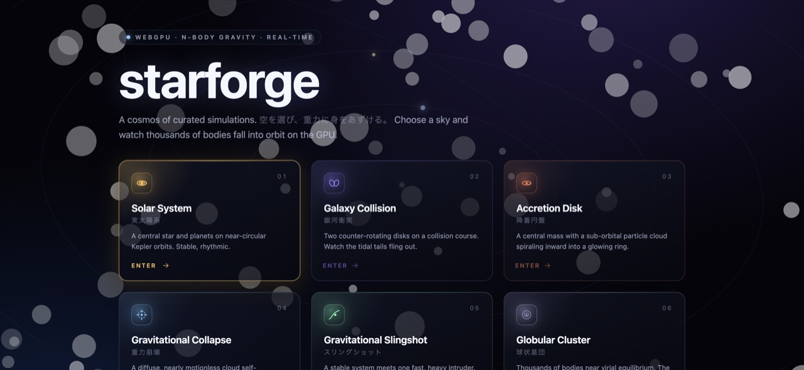
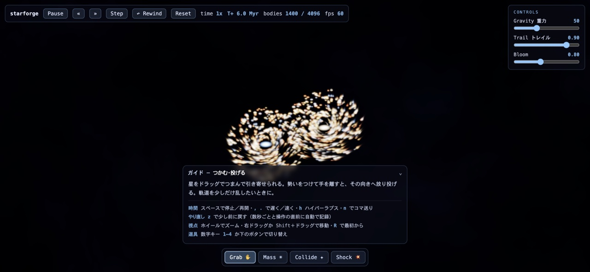
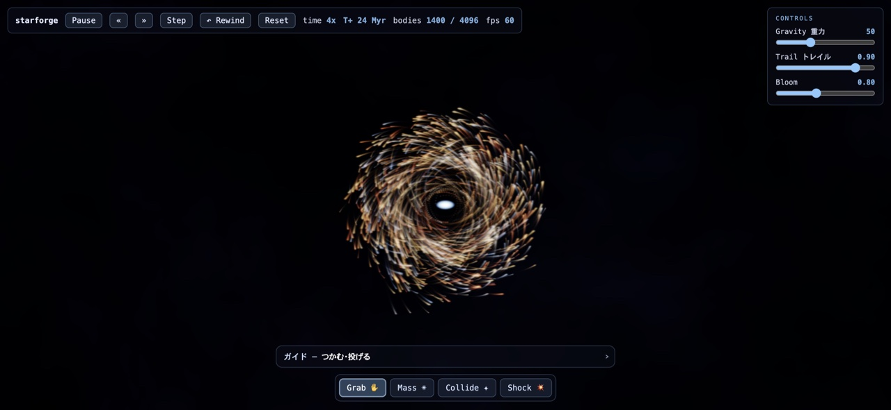

[日本語](./README.md) ・ [**English**](./README.en.md)

# WebGPU N-Body Gravity Sandbox (starforge-webgpu)

<!-- tech-stack:start (auto-generated) -->
<p align="center">
  
  
  
</p>
<!-- tech-stack:end -->

A cinematic physics-sandbox gallery that runs an **N-body gravity simulation** of thousands of bodies
on the GPU via compute shaders. Click a curated scene in the **gallery** to launch it **full-screen**,
then grab and throw stars, drop heavy bodies, hurl clusters into collisions, and fast-forward time
(hyperlapse) to watch the cosmos evolve. It's the "real computation" counterpart to
CSS-animation studies. No backend, no network — plain ES modules.

## Screenshots



| Galaxy collision (time controls, tools, and guide visible) | Accretion disk |
|---|---|
|  |  |

## Flow
**Gallery (6 scenes) → click for full-screen immersion → Esc to return.** The current scene is kept in the URL hash (`#scene=galaxy`).

| Scene | Highlight |
|---|---|
| Solar system | stable orbits, Keplerian rhythm |
| Galaxy collision | tidal tails, the big spectacle |
| Accretion disk | inward spiral, glowing ring |
| Collapse (birth) | diffuse gas → structure |
| Gravity slingshot | intruder accelerates and scatters |
| Globular cluster | many-body aggregation, the GPU's forte |

## Look (cinematic effects)
- **Bloom**: bright cores bleed light.
- **Orbit trails**: a decaying history buffer leaves fading light trails.
- **Nebula backdrop**: faint colored gas for depth.
- HDR offscreen (rgba16float) → ACES tonemap composite.

## Tools (four verbs)
Switch via the bottom toolbar or number keys `1`–`4`. Each tool's explanation shows in a collapsible **guide**.

| Tool | Gesture | Effect |
|---|---|---|
| Grab / throw | drag to pull → release to throw | attracts bodies near the cursor; release imparts the cursor's momentum |
| Place mass | drag (direction = velocity) | drops a heavy body that sweeps up its surroundings — seeds cores & accretion |
| Collide | drag to launch | fires a small cluster of stars to set up a collision with an existing group |
| Shock | click | a radial shockwave from the cursor that blasts compact structure apart |

View: wheel zoom · right/Shift-drag pan · `R` reset · `Esc` gallery.
> All interactions run as GPU compute passes (`interact.wgsl`) — no CPU readback or picking.

## Time control (forward-first)
"Speed" is the number of physics **substeps per frame** (dt stays fixed, so integration never blows up).

- `Space` pause/resume · `,` `.` slower/faster (0.25x–64x) · `h` **hyperlapse** (compress eons into seconds) · `n` single frame-step.
- A body-count-aware **load guard** trims effective substeps and the HUD shows the effective rate (e.g. `64x (~8x)`).
- An **epoch clock** (`T+ Myr/Gyr`) makes elapsed time visible.
- `z` **rewinds** a little (state is auto-snapshotted every few seconds and right before each interaction — lightweight GPU-buffer checkpoints).

## Stack
- **Rendering**: WebGPU (compute pipeline for force integration, render pipeline for points) + WGSL
- **Setup**: plain ES modules (no build step), zero dependencies, no CDN
- **Fallback**: a clear message when WebGPU is unavailable (never a blank page)

## Run & verify
In a WebGPU-capable browser (recent Chrome / Edge, etc.):
```sh
python3 -m http.server 8095   # → http://localhost:8095/
```

```sh
for f in src/shaders/*.wgsl; do naga "$f"; done   # validate WGSL
for f in src/*.js; do node --check "$f"; done       # JS syntax
node test/scenes.test.mjs                            # scene init conditions (78)
node test/bindings.test.mjs                          # binding contract (46)
```
> The actual rendered visuals (orbits, bloom, trails) are confirmed visually in a WebGPU browser.
